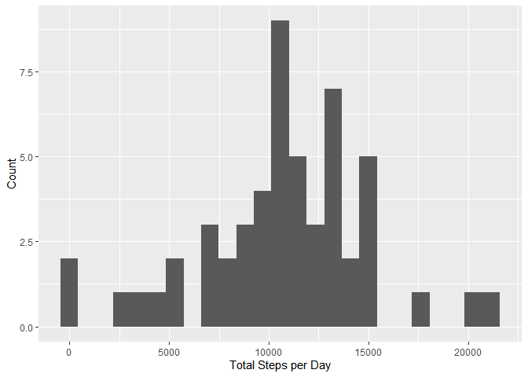
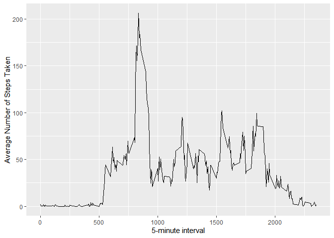
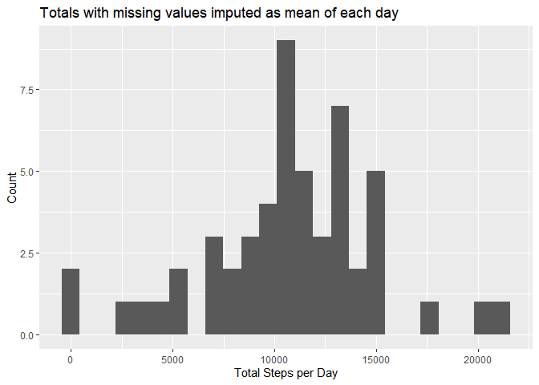
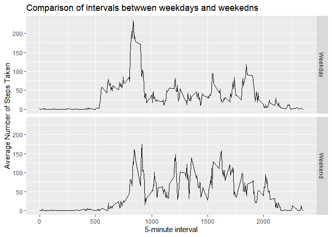

Activity Monitoring Analysis
============================

This report analyzes the activity data downloaded from [this
link.](https://d396qusza40orc.cloudfront.net/repdata%2Fdata%2Factivity.zip)

Loading and preprocessing the data
----------------------------------

    x <- read.csv("./activity.csv", header = TRUE)
    x$date <- as.Date.factor(x$date)

What is the mean total number of steps taken per day?
-----------------------------------------------------

Calculate the total number of steps taken per day.

    groupx <- group_by(x, date)
    total <- summarise(groupx, total = sum(steps)) %>% na.omit()

Make a histogram of the toal number of steps taken each day.

    ggplot(total, aes(x=total)) + geom_histogram(bins = 25) + labs(x = "Total Steps per Day", y = "Count")

Calculate the mean of the total number of steps taken per day.

    mean(total$total, na.rm = TRUE)

    ## [1] 10766.19

Calculate the median of the total number of steps taken per day.

    median(total$total)

    ## [1] 10765

What is the average daily activity pattern?
-------------------------------------------

Group data by interval and plot times series

    groupI <- group_by(x, interval)
    interval <- summarise(groupI, Mean = mean(steps, na.rm = TRUE))
    ggplot(interval, aes(x = interval, y = Mean)) + geom_line() + labs(x = "5-minute interval", y = "Average Number of Steps Taken")

Find the 5-minute interval, on average across all the days in the
dataset that contains the maximum number of steps.

     interval[which.max(interval$Mean),]

    ## # A tibble: 1 x 2
    ##   interval  Mean
    ##      <int> <dbl>
    ## 1      835  206.

Imputing missing values
-----------------------

Calculate the total number of missing values in the dataset.

    missingX <- is.na(x$steps)
    sum(missingX)

    ## [1] 2304

Create a lookup table with a key as the date and value as the mean for
each date.

    meanStep <- summarise(groupx, mean = mean(steps, na.rm = TRUE))
    get <- meanStep$mean
    names(get) <- as.character(meanStep$date)

Create a new data set by replacing the missing values with the mean of
each date. Use a for loop to replace the missing values using the look
up table.

    xnew <- x
    for (i in 1:nrow(xnew)) {
      if (is.na(xnew[i,1])) {
        xnew[i,1] <- get[as.character(xnew[i,2])]
      }
    }

Calculate the total number of steps taken per day with the new data set.

    groupxnew <- group_by(xnew, date)
    totalnew <- summarise(groupxnew, totalnew = sum(steps)) %>% na.omit()

Make a histogram of the toal number of steps taken each day with the new
data set.

    ggplot(totalnew, aes(x=totalnew)) + geom_histogram(bins = 25) + labs(x = "Total Steps per Day", y = "Count",title = "Totals with missing values imputed as mean of each day")

Calculate the mean of the total number of steps taken per day with the
new data set.

    mean(totalnew$totalnew)

    ## [1] 10766.19

Calculate the median of the total number of steps taken per day with the
new data set.

    median(totalnew$totalnew)

    ## [1] 10765

Are there differences in activity patterns between weekdays and weekends?
-------------------------------------------------------------------------

Create a new factor variable in the dataset with two levels – “weekday”
and “weekend” indicating whether a given date is a weekday or weekend
day.

    xnew$weekdays <- weekdays(xnew$date)
    xnew$day <- ifelse(xnew$weekdays == "Saturday" | xnew$weekdays == "Sunday", "Weekend", "Weekday")

    groupInew <- group_by(xnew, interval, day)
    intervalnew <- summarise(groupInew, Mean = mean(steps, na.rm = TRUE))
    ggplot(intervalnew, aes(x = interval, y = Mean)) + geom_line() + facet_grid(day~.) +labs(x = "5-minute interval", y = "Average Number of Steps Taken", title = "Comparison of intervals betwwen weekdays and weekedns")

